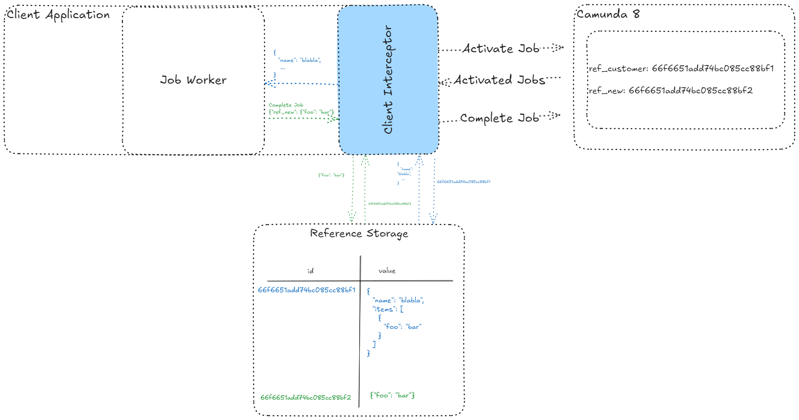

# Variable as Reference
 Using an Interceptor to store only references in Camunda

## Concept

- **Client Interceptor**: The interceptor manages data flow between the client application and Camunda. When activating or completing jobs, it ensures that only references (e.g., IDs) are stored in Camunda rather than the entire business data payload.

- **Reference Storage**: This external storage (e.g., database) holds the actual complex business data. Each entry in the storage has an ID and its associated data (value). Only the ID (reference) is stored in Camunda, avoiding direct storage of complex objects.

## Limitations

- Business data cannot be viewed in Operate or Tasklist.
- FEEL expressions involving business data are not usable, as Camunda only stores the reference.
- Currently, each time a variable is set by the job worker, a new reference is created.

## Design Decisions

The Client Interceptor was chosen because it allows each process application to utilize a custom reference storage. It can also be configured globally through a server interceptor.

